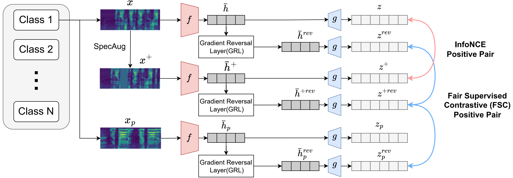

# FairASR: Fair Audio Contrastive Learning for Automatic Speech Recognition

This repository contains the implementation for our paper **"FairASR: Fair Audio Contrastive Learning for Automatic Speech Recognition"** accepted to Interspeech 2025.

📄 **Paper**: [arXiv:2506.10747](https://arxiv.org/pdf/2506.10747v1)  
📊 **Dataset**: [FairSpeech Dataset](https://ai.meta.com/datasets/speech-fairness-dataset/)



## Overview

FairASR addresses fairness in Automatic Speech Recognition (ASR) by leveraging contrastive learning to reduce demographic bias. The approach consists of two main stages:

1. **Pretraining**: Self-supervised contrastive learning with gradient reversal layer (GRL) to learn demographic-invariant representations
2. **Fine-tuning**: Supervised fine-tuning on ASR task using the pretrained encoder

## Dataset

We use the [FairSpeech Dataset](https://ai.meta.com/datasets/speech-fairness-dataset/) which contains speech samples with demographic annotations including:
- Age groups
- Gender
- Ethnicity
- First language
- Socioeconomic background

### Data Preprocessing

#### Pretraining Data (`train_manifest_converted.json`)

For pretraining, we filter the dataset to ensure stable training:
- **Maximum length**: 280k samples at 16kHz sample rate (17.5 seconds)
- This filtering reduces the number of samples from **26,472 to 22,946**
- Each sample includes demographic labels for supervised contrastive learning
- Manifest format: JSON lines with `audio_filepath`, `text`, `age`, `gender`, `ethnicity`, `first_language`, `socioeconomic_bkgd`

#### Fine-tuning Data (`train_manifest.json`, `test_manifest.json`)

For fine-tuning:
- Data is split into train/test sets with a **9:1 ratio**
- Split is performed uniformly across demographic classes to maintain balanced distribution
- Manifest format: JSON lines with `audio_filepath`, `text`, and demographic annotations

## Installation

Create and activate the conda environment from the provided YAML file:

```bash
conda env create -f fairasr.yaml
conda activate fairasr
```

## Usage

### Stage 1: Pretraining

Pretrain the encoder using contrastive learning with the `train_simclr.py` script.

**Basic usage (same space):**
```bash
python train_simclr.py \
    --balance_param 0.1
```

**With independent space (different projection heads):**
```bash
python train_simclr.py \
    --independent_space \
    --balance_param 0.1
```

**Arguments:**
- `--independent_space`: Use separate projection head for supervised contrastive loss (different embedding space)
- `--balance_param`: Balance parameter for supervised contrastive loss (default: 0.1). Setting this to 0 results in standard SimCLR pretraining without fairness constraints.
- `--resume_ckpt`: Path to checkpoint to resume training from (optional)

The pretrained encoder will be saved to `pretrained_encoder.pt`.

### Stage 2: Fine-tuning

Fine-tune the pretrained encoder on the ASR task using `train_hf.py`.

**Before running**, update the checkpoint path in `train_hf.py` (line 15):
```python
path = 'experiments/nemo_fairaudio_pretrain/simclr_supconGRL_1e-1_diffspace_checkpoints/last.ckpt'
```

**Run fine-tuning:**
```bash
python train_hf.py
```

The fine-tuned model will be saved as `.nemo` format in `experiments/nemo_fairaudio/simclr_supconGRL_1e-1_diffspace/`.

### Evaluation

Evaluate the fine-tuned model on various demographic groups using `validation.py`:

```bash
python validation.py
```

Make sure to update the model path in `validation.py` (line 9) to point to your fine-tuned model.

## Project Structure

```
facl/
├── train_simclr.py          # Pretraining script (SimCLR with GRL)
├── train_hf.py              # Fine-tuning script (Nemo-based)
├── validation.py            # Evaluation script
├── dataset.py               # Dataset utilities
├── model.py                 # Model architectures
├── utils.py                 # Utility functions
├── fairasr.yaml             # Conda environment file
├── metadata/
│   ├── train_manifest_converted.json    # Pretraining data (filtered, with labels)
│   ├── train_manifest.json              # Fine-tuning train split
│   └── test_manifest.json               # Fine-tuning test split
└── asr_fairness_audio/      # Audio dataset directory
```

## Key Features

- **Fair Contrastive Learning**: Combines SimCLR with supervised contrastive learning and gradient reversal layer
- **Demographic Invariance**: Uses GRL to learn representations that are invariant to demographic attributes
- **Flexible Architecture**: Supports both same-space and independent-space projection heads
- **Comprehensive Evaluation**: Evaluation across multiple demographic dimensions (age, gender, ethnicity, etc.)

## License

This code is provided for research purposes. Please refer to the FairSpeech Dataset license for dataset usage terms.

## Contact

For questions or issues, please open an issue on GitHub or contact the authors.

## Citation

If you use this code or dataset in your research, please cite:

```bibtex
@article{kim2025fairasr,
  title={FairASR: Fair Audio Contrastive Learning for Automatic Speech Recognition},
  author={Kim, Jongsuk and Yu, Jaemyung and Kwon, Minchan and Kim, Junmo},
  journal={arXiv preprint arXiv:2506.10747},
  year={2025}
}
```

